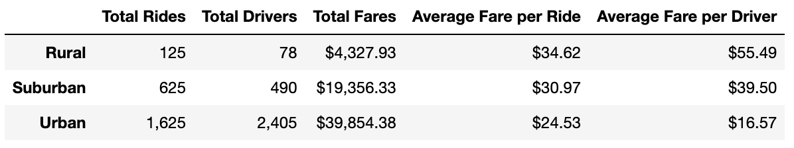
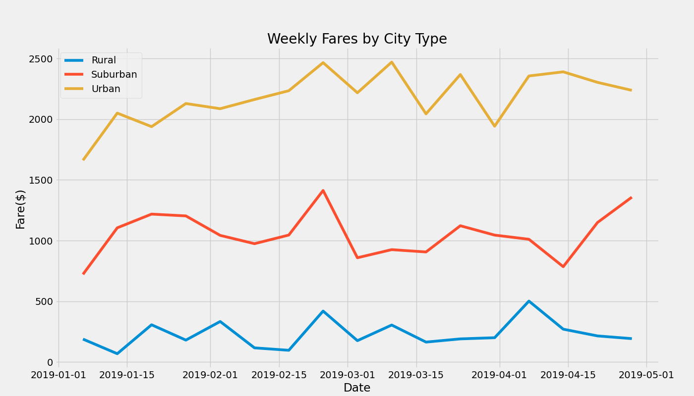

# PyBer_Analysis

## Overview
The purpose of this analysis was to compare PyBer ride-share fares between different city types. This analysis looked at how the total weekly fares of each city type changed during a four month long period of time. 

## Results
As can be seen in the image below, cities in rural areas had a much higher average fare per driver and per ride than in suburban and urban cities. Despite this, rural cities gained significantly less in total fares. This is because much fewer rides were given in rural areas. It is important to note that the average fare per driver in rural areas was much higher than the average fare per ride. This is because there are very few drivers in rural areas. In urban cities on the other hand, the average fare per driver was lower than the average fare per ride. This is because there are a very large number of drivers in urban areas. Despite a low average fare per driver and per ride in urban areas, these cities actually earned the most amount of money in fares simply because of how many rides there were.

Furthermore, from the image below, we can see that rural cities had the lowest weekly fare totals while urban cities had the highest with suburban cities sitting somewhere in between. We can also see that weekly fares across all city types seemed to fluctuate at the same time. For example, every city saw a spike in weekly fares at the end of February. However, both rural and urban cities saw another spike in weekly fares during the first and second weeks of March while suburban areas actually saw a decrease in weekly fares around the same time.

